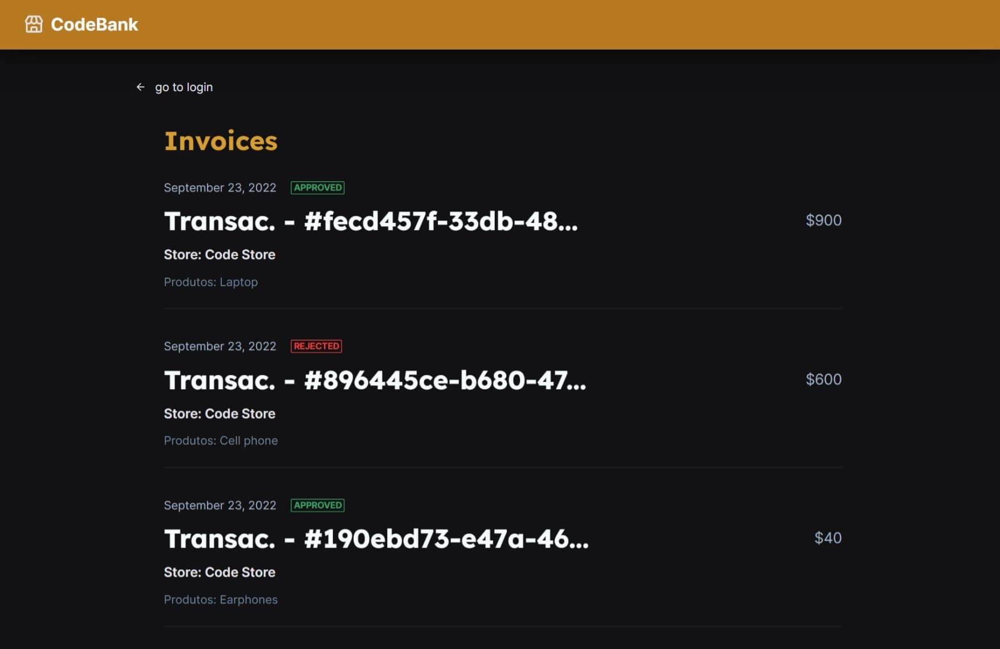

<h1 align="center">
    
</h1>

<h2 align="center">

[](https://github.com/pauloreis7/codebank/issues)
[](https://github.com/pauloreis7/codebank)
[](https://github.com/pauloreis7/codebank/commits)
[](https://github.com/pauloreis7/codebank/stargazers)
[](https://github.com/pauloreis7/codebank/blob/master/LICENSE)

</h2>

<h1 align="center">
    
</h1>

<h4 align="center">🏁 Application already finished 🏁</h4>

<p align="center">🏦 Digital bank for issuing credit cards and making purchases in an e-store. Micro services based ☁️</p>

## 🔗 Index

---

 <p>👉 <a href="#about">About the project</a> </p>
 <p>👉 <a href="#layout">Application Layout</a> </p>
 <p>👉 <a href="#func">Features</a> </p>
 <p>👉 <a href="#techs">Technologies</a> </p>
 <p>👉 <a href="#requests">Project Prerequisites</a> </p>
 <p>👉 <a href="#work">Download and execution</a> </p>
 <p>👉 <a href="#contribute">Contribute with the project</a> </p>
 <p>👉 <a href="#author">Author</a> </p>
 <p>👉 <a href="#license">License</a> </p>

<a id="about"></a>

## 🔎 About the project

---

<p>Application completely based on micro services of a digital bank for issuing credit cards and financial transactions. Integrated to an e-commerce to perform purchase transactions over the internet with the created credit card.</p>

<a id="layout"></a>

## 🎨 Application Layout

---

<p align="center">

## 💻 Desktop

### 🏪 Store


### 🏦 Bank




## 📱 Mobile

### 🏪 Store


### 🏦 Bank


</p>

<a id="func"></a>

## ✅ Features

---

- [x] E-commerce for purchase transactions
- [x] See purchase order
- [x] Digital bank for issue credit cards
- [x] Responsive
- [x] Perform financial transactions with the created credit card
- [x] View credit card invoice with transactions status
- [x] Asynchronous messaging system for communication between microservices
- [x] Use gRPC and HTTP2 for web communication
- [x] Containerization of all microservices
- [x] Integration of kafka connect with elasticsearch and kibana
- [x] Use elasticsearch and kibana to visualize transaction metrics dashboards

- [x] Microservice: bank
- [x] Microservice: store-api
- [x] Microservice: store-web
- [x] Microservice: invoices-api
- [x] Microservice: invoices-web

<a id="techs"></a>

## 🧪 Technologies

---

### 💻 Project developed with the following technologies

- [Apache Kafka](https://kafka.apache.org/)
- [Elasticsearch](https://www.elastic.co/elasticsearch/)
- [Kibana](https://www.elastic.co/kibana/)
- [Docker](https://www.docker.com/)
- [gRPC](https://www.grpc.io/)
- [Postgresql](https://www.postgresql.org/)
- [Python](https://www.python.org/)
- [SQLAlchemy / Alembic](https://www.sqlalchemy.org/)
- [Pydantic](https://pydantic-docs.helpmanual.io/)
- [Poetry](https://python-poetry.org/)
- [TypeScript](https://www.typescriptlang.org/)
- [JavaScript](https://www.javascript.com/)
- [React](https://reactjs.org/)
- [Nextjs](https://nextjs.org/)
- [Node](https://nodejs.org/)
- [Chakra-ui](https://chakra-ui.com/)
- [React query](https://react-query.tanstack.com/)
- [Nestjs](https://nestjs.com/)
- [Prisma](https://www.prisma.io/)

<a id="requests"></a>

## 🚨 Project Prerequisites

---

Before you start, you will need to have the following tools installed on your machine:

- [Git](https://git-scm.com)
- [Python](https://www.python.org/)
- [Poetry](https://python-poetry.org/)
- [Node](https://nodejs.org/)

🐳 Run the containerized api (Docker)

- [Docker-compose](https://docs.docker.com/compose/)

💡 Also, it is good to have an editor to work with the code like [VSCode](https://code.visualstudio.com/)

<a id="work"></a>

## 🏄‍♂️ Download and execution

---

```bash

# Clone the repository
$ git clone <https://github.com/pauloreis7/codebank>

# Access the project folder terminal/cmd
$ cd codebank

# Open project in VSCode
$ code .

# Navigate (cd) to each of the microservices folder and run the docker-compose
$ docker compose up

# The store web app will start on port 3001
access  <http://localhost:3001>

# The bank web app will start on port 3000
access  <http://localhost:3000>

```

<a id="contribute"></a>

## 🎉 How Contribute

[](https://github.com/pauloreis7/codebank/pulls)

---

<b>1. Fork the project.</b> <br />
<b>2. Create a new branch with your changes: git 3. checkout -b my-feature</b> <br />
<b>3. Save your changes and create a commit message telling what you have done: git commit -m "feat: My new feature</b> <br />
<b>4. Submit your changes: git push origin my-feature</b>

<a id="author"></a>

## Author

---

## 👨‍💻 Author

<a href="https://github.com/pauloreis7">


<b>Paulo Reis</b> 🏆

</a>

<p>Made by Paulo Reis 🤴 Contact us 👋</p>

<a href = "mailto:paulosilvadosreis2057@gmail.com"></a>
<a href="https://www.linkedin.com/in/paulo-reis7/" target="_blank"></a>
<a href="https://www.instagram.com/pauloreis.7" target="_blank"></a>

<a id="license"></a>

## 📝 License

---

This project is under the MIT license. See the [LICENSE](LICENSE) file for more details.🏛️
